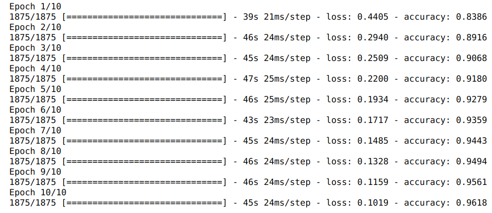
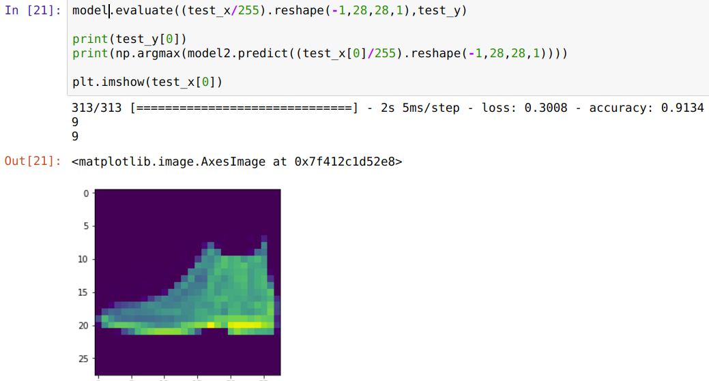

# tensorflow 2系列02 图像分类(Image classification using TensorFlow 2.x)

本期文章是一个系列课程，本文是这个系列的第2篇复习笔记
(1)Build and train neural network models using TensorFlow 2.x
(2)Image classification
(3)Natural language processing(NLP)
(4)Time series, sequences and predictions

## 图像分类

图像分类在现有阶段，几乎全部是用神经网络来弄了，传统的线性分类模型已经没有了市场，特别是cnn的出现，真是大杀器一样的存在，使得图像分类准确率提高了一个特别高的水平．

### 关于CNN(卷积神经)

cnn不是本文的重点，但稍微还是说一点，卷积主要是用来提提取特征的，池化主要降维和特征强化．具体可以参考文章
https://www.zhihu.com/question/49376084

### tensorflow２中使用cnn

在tf2中使用cnn非常简单，主要是在神经网络的输入层构建时，使用cnn和池化做几层的网络搭建，后面再使用传统的Flatten层，Dense层，配合激活函数，达到输入一个概率值的目的．

### 代码实战

``` python
#　卷积神经网络
import matplotlib.pyplot as plt
import numpy as np
import tensorflow as tf
from tensorflow.python.keras.backend_config import epsilon

if __name__ == "__main__":
    (train_x,train_y),(test_x,test_y)=tf.keras.datasets.fashion_mnist.load_data()
    
    model=tf.keras.models.Sequential([
        tf.keras.layers.Conv2D(64,(3,3),activation=tf.nn.relu,input_shape=(28,28,1)),
        tf.keras.layers.MaxPool2D(2,2),
        tf.keras.layers.Conv2D(64,(3,3),activation=tf.nn.relu),
        tf.keras.layers.MaxPool2D(2,2),
        tf.keras.layers.Flatten(),
        tf.keras.layers.Dense(128,activation=tf.nn.relu),
        tf.keras.layers.Dense(10,activation=tf.nn.softmax)
    ])
    model.compile(optimizer="adam",loss=tf.keras.losses.sparse_categorical_crossentropy,metrics=["accuracy"])
    model.fit((train_x/255).reshape(-1,28,28,1),train_y,epochs=2,)

    model.evaluate((test_x/255).reshape(-1,28,28,1),test_y)
    
    print(test_y[0])
    print(np.argmax(model.predict((test_x[0]/255).reshape(-1,28,28,1))))
    plt.imshow(test_x[0])

```

### 输出效果



### 总结

* 进行特征归一化到0, 1之间，有利于加快训练收敛速度和提高精度．上面的train_x/255就是为了归一化
* 模型的第一层一定要指定input_shape，如果是用tensorflow原生api，还得指定参数的shape，这里是用了keras，帮我们自动推导了参数的shape
* 损失函数的选择，如果train_label是具体的值，预测的是概率，就选择sparse这个开头的损失函数．如果train label是one_hot值，就选择不带sparse的这个（categorical_crossentropy）．这个keras的api中有详细说明，具体后面会有再次关于损失函数的笔记， 

*　还是关于shape，输入的数据是什么shape，在预测阶段也要保证相同的输入shape，否则会报错．具体的可以通过reshape来调整．

* 神经网络主要数据和模型结构是关键．在数据（包含数据处理）相同的情况下，模型的结构决定了模型的精度．比如，一个简单的二层（dense层，一个输出层）就比cnn效果差
